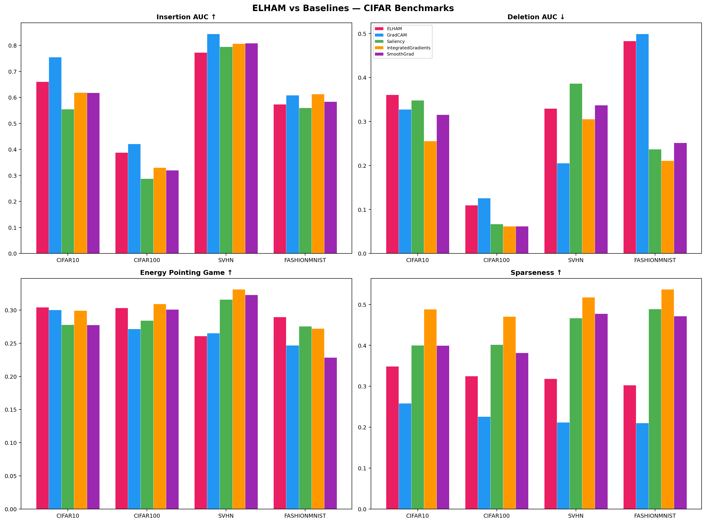
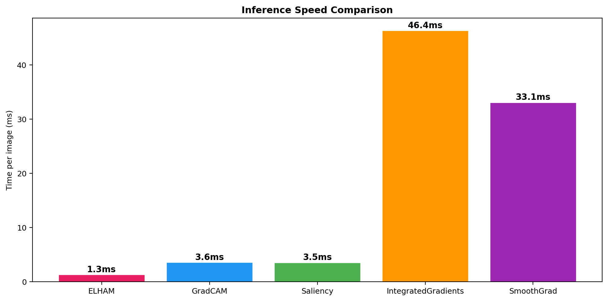
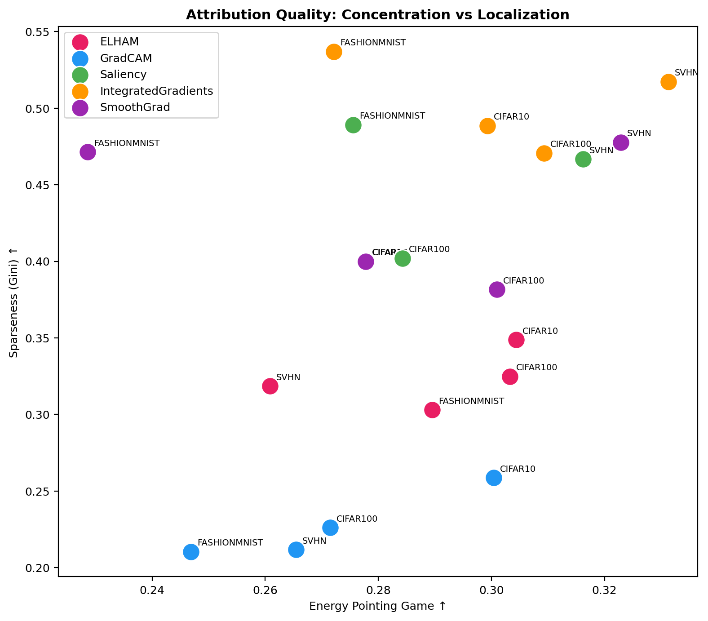
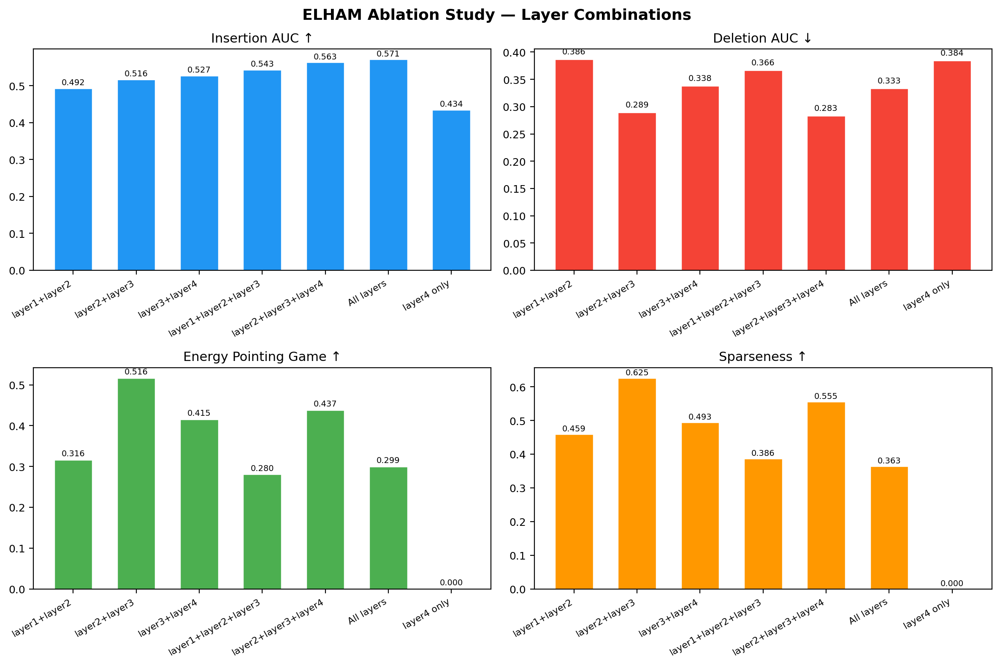

# Elham: Entropy-driven Latent Hierarchical Attribution Maps

[](https://python.org)
[](https://pytorch.org)
[](LICENSE)

**A novel explainable AI (XAI) method based on information theory. No training data, no gradient computation — one forward pass.**

ELHAM measures how a neural network's internal representation becomes more *decisive* as it processes an image. At each layer and spatial location, it computes the entropy of the channel distribution. Regions where entropy drops sharply between layers — where the model transitions from uncertainty to certainty — are the most important for the model's processing.

```
E → Entropy-driven     (channel entropy at each spatial location)
L → Latent             (operates on intermediate feature maps)
H → Hierarchical       (measures entropy reduction between layers)
A → Attribution        (spatial maps of information gain)
M → Maps               (multi-resolution, across network depths)
```

---

## How It Works

For an input image $x$, at each layer $l$ and spatial location $(i,j)$:

$$H(z_l)\_{i,j} = -\sum\_{k=1}^{C} p_k \log p_k, \quad p_k = \text{softmax}(z_{l,i,j})_k$$

Normalized by $\log(C)$ for cross-layer comparability. Then:

$$\Delta I_l = \max(0,\, H(z_{l-1}) - H(z_l))$$

$$A = \sum_l \text{Upsample}(\Delta I_l)$$

**Intuition**: A peaked channel distribution (low entropy) means the model has formed decisive features — it "knows what it's looking at." A flat distribution (high entropy) means uncertainty. Information gain identifies where the model's representation becomes sharper.

---

## Multi-Resolution Attribution (ImageNet, ResNet50)

ELHAM produces attribution maps at every network depth, revealing how the model's certainty evolves:


*Left to right: Input → Initial entropy H(layer1) → Information gain ΔI(layer2) → ΔI(layer3) → ΔI(layer4) → ELHAM combined overlay → GradCAM overlay*

---

## Results

### CIFAR-10 (89% accuracy)
| Method | Ins AUC ↑ | Del AUC ↓ | PointGame ↑ | Energy PG ↑ | Time (ms) |
|--------|-----------|-----------|-------------|-------------|-----------|
| Grad-CAM | **0.755** | 0.328 | **1.00** | 0.300 | 4.1 |
| **ELHAM** | 0.661 | 0.361 | 0.64 | **0.304** | **1.6** |
| Integrated Gradients | 0.619 | **0.256** | 0.58 | 0.299 | 47.6 |
| SmoothGrad | 0.618 | 0.316 | 0.44 | 0.278 | 34.0 |
| Saliency | 0.555 | 0.348 | 0.48 | 0.278 | 3.8 |

### CIFAR-100 (63% accuracy)
| Method | Ins AUC ↑ | Del AUC ↓ | PointGame ↑ | Energy PG ↑ | Time (ms) |
|--------|-----------|-----------|-------------|-------------|-----------|
| Grad-CAM | **0.422** | 0.126 | **0.90** | 0.272 | 3.0 |
| **ELHAM** | 0.389 | 0.110 | 0.76 | **0.303** | **1.3** |
| Integrated Gradients | 0.331 | **0.062** | 0.64 | 0.309 | 46.1 |
| SmoothGrad | 0.320 | 0.062 | 0.74 | 0.301 | 32.4 |
| Saliency | 0.288 | 0.067 | 0.62 | 0.284 | 3.2 |

### SVHN (95% accuracy)
| Method | Ins AUC ↑ | Del AUC ↓ | PointGame ↑ | Energy PG ↑ | Time (ms) |
|--------|-----------|-----------|-------------|-------------|-----------|
| Grad-CAM | **0.844** | **0.206** | **0.92** | 0.265 | 4.1 |
| SmoothGrad | 0.808 | 0.337 | 0.60 | 0.323 | 40.0 |
| Integrated Gradients | 0.807 | 0.306 | 0.50 | **0.331** | 54.8 |
| Saliency | 0.795 | 0.387 | 0.54 | 0.316 | 4.2 |
| **ELHAM** | 0.773 | 0.330 | 0.56 | 0.261 | **1.3** |

### FashionMNIST (92% accuracy)
| Method | Ins AUC ↑ | Del AUC ↓ | PointGame ↑ | Energy PG ↑ | Time (ms) |
|--------|-----------|-----------|-------------|-------------|-----------|
| Integrated Gradients | 0.613 | **0.211** | 0.60 | 0.272 | 36.9 |
| Grad-CAM | 0.609 | 0.499 | 0.54 | 0.247 | 3.0 |
| SmoothGrad | 0.584 | 0.251 | 0.28 | 0.229 | 26.0 |
| **ELHAM** | 0.574 | 0.483 | **0.62** | **0.290** | **1.0** |
| Saliency | 0.560 | 0.237 | **0.68** | 0.276 | 2.7 |

### ImageNet (ResNet50 pretrained, 224×224)
| Method | Ins AUC ↑ | Del AUC ↓ | Energy PG ↑ | Time (ms) |
|--------|-----------|-----------|-------------|-----------|
| Grad-CAM | **0.641** | 0.214 | **0.355** | 23.6 |
| **ELHAM** | 0.578 | 0.213 | 0.261 | **10.8** |
| SmoothGrad | 0.516 | **0.096** | 0.282 | 188.5 |
| Integrated Gradients | 0.456 | 0.110 | 0.253 | 254.4 |
| Saliency | 0.429 | 0.163 | 0.194 | 15.2 |

---

## Benchmark Visualizations

### Per-Dataset Comparison


### Speed Comparison


*ELHAM is 20-40× faster than Integrated Gradients and SmoothGrad.*

### Attribution Quality Tradeoff


*Sparseness (concentration) vs Energy Pointing Game (localization).*

---

## Ablation Study

Which layer combinations produce the best attributions?



| Configuration | Ins AUC ↑ | Del AUC ↓ | EPG ↑ | Sparseness |
|---|---|---|---|---|
| layer2+3 | 0.516 | **0.289** | **0.516** | **0.625** |
| layer2+3+4 | 0.563 | 0.283 | 0.437 | 0.555 |
| layer3+4 | 0.527 | 0.338 | 0.415 | 0.493 |
| All layers | **0.571** | 0.333 | 0.299 | 0.363 |
| layer1+2+3 | 0.543 | 0.366 | 0.280 | 0.386 |
| layer4 only | 0.434 | 0.384 | 0.000 | 0.000 |

**Key insight**: Layer 1 adds noise. **layer2+3 alone** gives the sharpest, most localized attributions. All layers produces best faithfulness but more diffuse maps.

---

## Key Properties

| Property | ELHAM | Grad-CAM | Saliency | IG | SmoothGrad |
|----------|-------|----------|----------|-----|------------|
| Forward passes | **1** | 1 | 1 | 20 | 15 |
| Backward passes | **0** | 1 | 1 | 20 | 15 |
| Needs training data | **No** | No | No | No | No |
| Multi-resolution | **Yes** | No | No | No | No |
| Class-specific | No | Yes | Yes | Yes | Yes |

---

## Quick Start

```bash
# Install
pip install torch torchvision numpy scipy matplotlib

# Full evaluation (trains models, runs all baselines, generates all plots)
python eval_full.py --datasets cifar10,cifar100,svhn,fashionmnist --samples 50 --epochs 12 --steps 30

# Include ImageNet (needs pretrained ResNet50, auto-downloads demo images if val set unavailable)
python eval_full.py --datasets cifar10,cifar100,svhn,fashionmnist,imagenet --samples 50 --epochs 12 --steps 30

# Quick test
python eval_full.py --datasets cifar10 --samples 10 --epochs 3 --steps 10
```

## Requirements

- Python 3.10+
- PyTorch ≥ 2.0
- torchvision, numpy, scipy, matplotlib
- GPU recommended (H200 used for benchmarks above)

## Citation

```bibtex
@software{elham2026,
  title        = {ELHAM: Entropy-driven Latent Hierarchical Attribution Maps},
  author       = {Hnajafi95},
  year         = {2026},
  url          = {https://github.com/Hnajafi95/ELHAM},
  note         = {Self-entropy XAI method — no gradients, no training data},
}
```

## License

MIT
