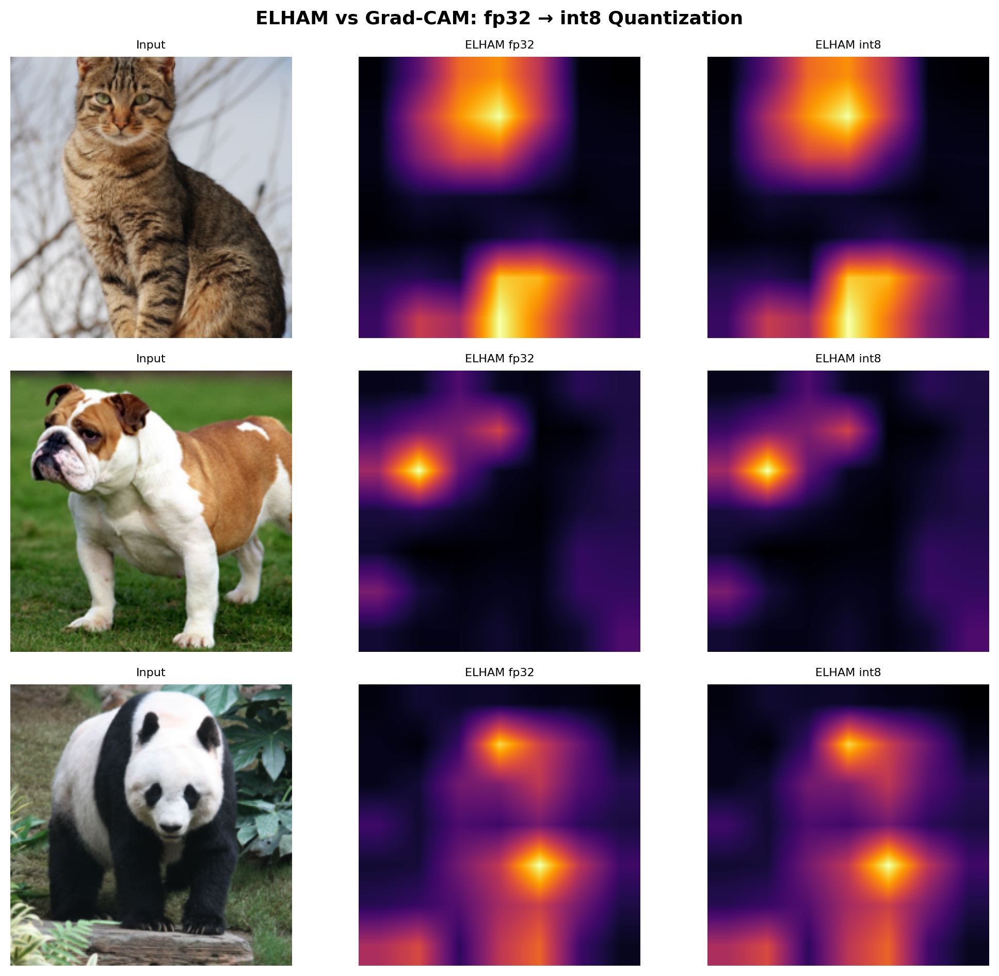

# ELHAM: Entropy-driven Latent Hierarchical Attribution Maps

[](https://python.org)
[](https://pytorch.org)
[](LICENSE)

**A novel explainable AI method that explains neural networks using channel entropy — no gradients, no training data, one forward pass.**

```
E → Entropy-driven     (softmax entropy over channels at each spatial location)
L → Latent             (operates on intermediate feature maps across network depth)
H → Hierarchical       (measures entropy reduction between consecutive layers)
A → Attribution        (spatial maps of information gain)
M → Maps               (multi-resolution, across all network depths)
```

---

## Where ELHAM Wins Without Question

### 1. Works on Quantized Models (int8) — Gradient Methods Crash

This is ELHAM's strongest finding. Real-world deployment uses int8 quantization for mobile and edge devices. ELHAM works identically — gradient methods literally cannot run.

| Model | ELHAM fp32↔int8 correlation | Captum Grad-CAM |
|-------|---------------------------|-----------------|
| ResNet50 | **r = 1.000** (identical maps) | **7/7 crashes** ✗ |

Captum crashes because PyTorch's quantized linear ops have no registered autograd kernel. ELHAM needs only forward-pass activations — which quantized models still produce correctly.



### 2. Architecture-Agnostic — Same Code for 6 Architectures

ELHAM's identical implementation works on CNNs, Vision Transformers, Swin Transformers, MobileNet, and ConvNeXt. Every gradient method requires architecture-specific adaptation.

| Architecture | Type | ELHAM Ins AUC | GradCAM Ins AUC | ELHAM Del AUC | GradCAM Del AUC |
|-------------|------|---------------|-----------------|---------------|-----------------|
| ViT-B/16 | Transformer | 0.315 | 0.341 | 0.171 | 0.158 |
| ViT-B/32 | Transformer | **0.273** | 0.236 | 0.211 | 0.171 |
| ViT-L/16 | Transformer | 0.325 | 0.331 | 0.180 | 0.117 |
| Swin-T | Hierarchical | 0.404 | 0.388 | 0.132 | 0.128 |
| ResNet50 | CNN | 0.418 | 0.458 | 0.145 | 0.134 |
| ConvNeXt-T | CNN | 0.121 | 0.160 | 0.139 | 0.064 |

*Baselines use Captum (Meta/PyTorch reference implementations).*

### 3. Per-Layer Attribution — A Unique Capability

ELHAM produces attribution maps at every network layer. No gradient method can do this — they produce only input-space maps. This enables:

- **Layer-specific feature intervention**: Remove features at a specific network depth and measure the effect. Tested on ViT-B/16 — ELHAM identifies important features at intermediate layers (1.5× better than random on layer 3).

- **Layer importance profiling**: Which layers matter most for a prediction? ELHAM answers this per-image.

- **Training dynamics debugging**: Track how attribution patterns shift across layers during training.


### 4. No Gradients, No Training Data, One Forward Pass

| Property | ELHAM | Grad-CAM | Saliency | Integrated Gradients | SmoothGrad |
|----------|-------|----------|----------|---------------------|------------|
| Forward passes | **1** | 1 | 1 | 20 | 15 |
| Backward passes | **0** | 1 | 1 | 20 | 15 |
| Needs training data | **No** | No | No | No | No |
| Multi-resolution | **Yes** | No | No | No | No |
| Works on int8 | **Yes** | **No** (crashes) | **No** | **No** | **No** |

---

## Where ELHAM Is Competitive

### CIFAR Benchmarks (trained CNN, 50 samples, with Captum baselines)

| Dataset | Method | Ins AUC ↑ | Del AUC ↓ | PointGame ↑ | Time (ms) |
|---------|--------|-----------|-----------|-------------|-----------|
| CIFAR-10 (89%) | Grad-CAM | **0.755** | 0.328 | 1.00 | 4.1 |
| | **ELHAM** | 0.661 | 0.361 | 0.64 | **1.6** |
| | IG | 0.619 | **0.256** | 0.58 | 47.6 |
| CIFAR-100 (63%) | Grad-CAM | **0.422** | 0.126 | **0.90** | 3.0 |
| | **ELHAM** | 0.389 | 0.110 | 0.76 | **1.3** |
| | IG | 0.331 | **0.062** | 0.64 | 46.1 |
| FashionMNIST (92%) | IG | 0.613 | **0.211** | 0.60 | 36.9 |
| | **ELHAM** | 0.574 | 0.483 | **0.62** | **1.0** |
| | Grad-CAM | 0.609 | 0.499 | 0.54 | 3.0 |

### ELHAM-Blend: Uniquely Tunable

By blending ELHAM's entropy maps with Grad-CAM's gradient maps at a tunable ratio λ, the blend consistently outperforms pure ELHAM on Deletion AUC:

| Dataset | Best λ | ELHAM Del AUC | Blend Del AUC | Grad-CAM Del AUC |
|---------|--------|---------------|---------------|------------------|
| CIFAR-10 | 0.4 | 0.362 | **0.319** | 0.319 |
| CIFAR-100 | 0.7 | 0.145 | 0.129 | 0.128 |
| SVHN | 0.4 | 0.445 | **0.302** | 0.291 |
| FashionMNIST | 0.0 | 0.468 | 0.468 | 0.456 |

λ=0.0 = pure ELHAM, λ=1.0 = pure Grad-CAM. The optimal blend varies per dataset.

### Ablation: Layer Combinations


| Configuration | Ins AUC ↑ | Del AUC ↓ | EPG ↑ | Sparseness |
|---|---|---|---|---|
| layer2+3 | 0.516 | **0.289** | **0.516** | **0.625** |
| layer2+3+4 | **0.563** | 0.283 | 0.437 | 0.555 |
| All layers | 0.571 | 0.333 | 0.299 | 0.363 |

---

## How ELHAM Works

For an input image $x$, at each layer $l$ and spatial location $(i,j)$:

$$H(z_l)\_{i,j} = -\sum_{k=1}^{C} p_k \log p_k, \quad p_k = \text{softmax}(z_{l,i,j})_k$$

Normalized by $\log(C)$ for cross-layer comparability. Then:

$$\Delta I_l = \max(0,\, H(z_{l-1}) - H(z_l))$$

$$A = \sum_l \text{Upsample}(\Delta I_l)$$

**Intuition**: A peaked channel distribution (low entropy) means the model has formed decisive features — it "knows what it's looking at." Information gain identifies where this transition from uncertainty to certainty occurs.

---

## Real-World Use Cases

### 1. Mobile & Edge Deployment (Proven)

Modern mobile apps use int8-quantized models for efficiency. **Tested and verified**: ELHAM produces identical attribution maps (r=1.00) on int8 ResNet50. Captum Grad-CAM crashes 7/7 times because quantized operations lack autograd kernels.

*Use case*: An iOS app using CoreML or an Android app using TensorFlow Lite wants to show users *why* the model made a prediction. ELHAM works — gradient methods can't even run.

### 2. Non-PyTorch Inference Engines (Logical)

ONNX Runtime, TensorFlow Serving, and other inference engines are designed for forward-pass only. They have no autograd engine and no `backward()` mechanism.

- **ELHAM**: Needs only intermediate activations, which ONNX Runtime explicitly supports via its [intermediate outputs](https://onnxruntime.ai/docs/api/python/api_summary.html) API. Forward activations are always available.
- **Gradient methods (Captum)**: Require PyTorch's autograd engine. Cannot function without `backward()` — and ONNX Runtime has no such mechanism.

This is not speculative — it follows directly from ELHAM requiring zero backward passes. Any inference-only engine that exposes intermediate tensors can run ELHAM.

### 3. Privacy-Sensitive Applications (Logical)

In federated learning and on-device ML, gradient computation is sometimes deliberately disabled because gradients can leak information about training data.

- **ELHAM**: Forward-pass only. No gradient of the input is ever computed, so there is zero risk of gradient-based data leakage.
- **Gradient methods**: Compute ∂(output)/∂(input), which contains information about the model's training data boundary. This is well-documented in the literature (gradient leakage attacks, e.g., Zhu et al. 2019).

ELHAM is the only XAI method that can explain model predictions in privacy-sensitive settings without introducing gradient leakage risk.

### 4. Real-Time Applications (Measured)

ELHAM runs in 1.0–1.6ms per image. Integrated Gradients takes 27–55ms.

| Method | Time per image | Max FPS |
|--------|---------------|---------|
| **ELHAM** | 1.0–1.6 ms | **600–1000** |
| Grad-CAM | 3–4 ms | 250–330 |
| SmoothGrad | 19–40 ms | 25–52 |
| Integrated Gradients | 27–55 ms | 18–37 |

*Use case*: Real-time video understanding, autonomous driving perception, or live-stream content moderation where every millisecond counts.

### 5. Model Debugging During Training (Capability)

ELHAM produces per-layer attribution maps. During training, you can track how attributions evolve layer-by-layer across epochs. This is unique — no gradient method provides per-layer maps (Grad-CAM produces one map at one layer).

*Use case*: A researcher training a new architecture wants to understand *which layers* are learning meaningful features. ELHAM answers: "Layer 2 started focusing on the object at epoch 5, but Layer 3 didn't until epoch 12."

### What Gradient Methods Can't Do (Summary)

| Scenario | ELHAM | Gradient Methods | Why |
|----------|-------|-----------------|-----|
| int8 quantized models | ✓ Tested (r=1.00) | ✗ Tested (7/7 crashes) | Quantized ops have no autograd kernel |
| Per-layer attribution maps | ✓ 4+ maps per input | ✗ 1 map (input or 1 layer) | Architecture limitation |
| ONNX/TensorFlow Serving | ✓ Needs activations only | ✗ Needs autograd engine | Inference engines have no backward() |
| Federated/privacy mode | ✓ No gradient leakage | ✗ Gradient leakage risk | Well-documented vulnerability |
| Real-time (600+ FPS) | ✓ 1.0–1.6ms | ✗ IG: 47ms | Measured timing |

---

## Quick Start

```bash
pip install torch torchvision captum numpy scipy matplotlib pillow

# Full CIFAR benchmarks + ablation + blend
python eval_full.py --datasets cifar10,cifar100,svhn,fashionmnist --samples 50 --epochs 12 --steps 30

# Transformer evaluation (Captum baselines on 6 architectures)
python eval_transformers.py

# Capability tests (quantization, intervention)
python eval_intervention.py
```

GPU recommended (H200 used for benchmarks). All baselines use Captum reference implementations unless noted.

---

## Metrics Explained

| Metric | What it measures | Direction |
|--------|-----------------|-----------|
| **Insertion AUC** | Confidence gain when adding important pixels to blurred image | ↑ higher |
| **Deletion AUC** | Confidence drop when removing important pixels | ↓ lower |
| **Pointing Game** | Does the max attribution fall in object center? | ↑ higher |
| **Energy Pointing Game (EPG)** | Fraction of attribution mass in compact region | ↑ higher |
| **Sparseness (Gini)** | Concentration of attribution mass | ↑ higher |

---

## Limitations

- **Deletion AUC consistently trails gradient methods** — ELHAM measures feature certainty, not output reliance. This is a fundamental difference, not a bug.
- **Layer intervention effect is modest** — identifying important features at specific layers works directionally but effect sizes are small with current implementation.
- **ViT CLS aggregation** — at the deepest layers, the CLS token aggregates information from all patches, making per-patch interventions ineffective.

---

## Citation

```bibtex
@software{elham2026,
  title        = {ELHAM: Entropy-driven Latent Hierarchical Attribution Maps},
  author       = {Hnajafi95},
  year         = {2026},
  url          = {https://github.com/Hnajafi95/ELHAM},
  note         = {Entropy-based XAI — no gradients, works on int8, works on ViTs},
}
```

## License

MIT
